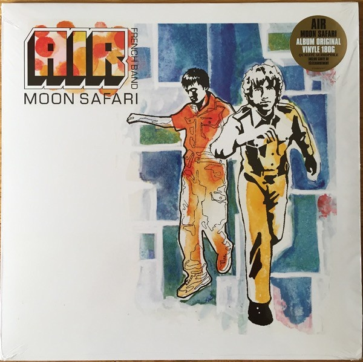
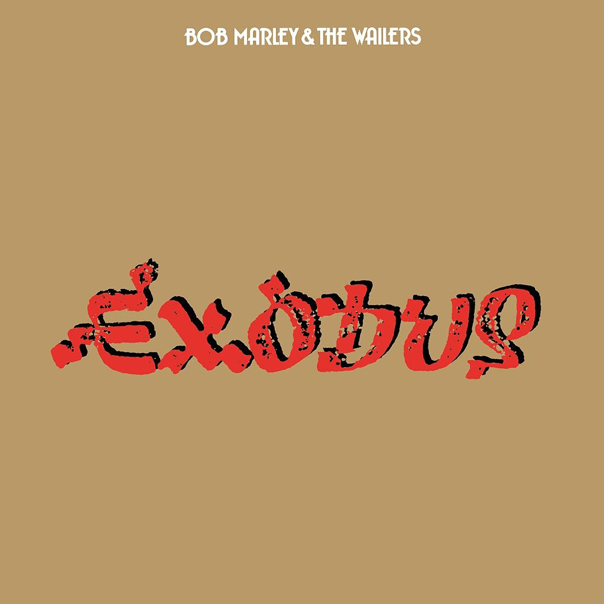
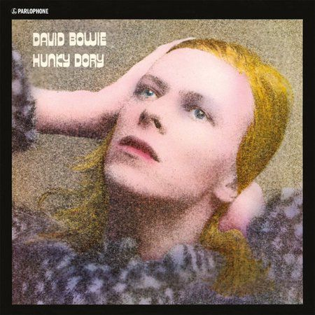
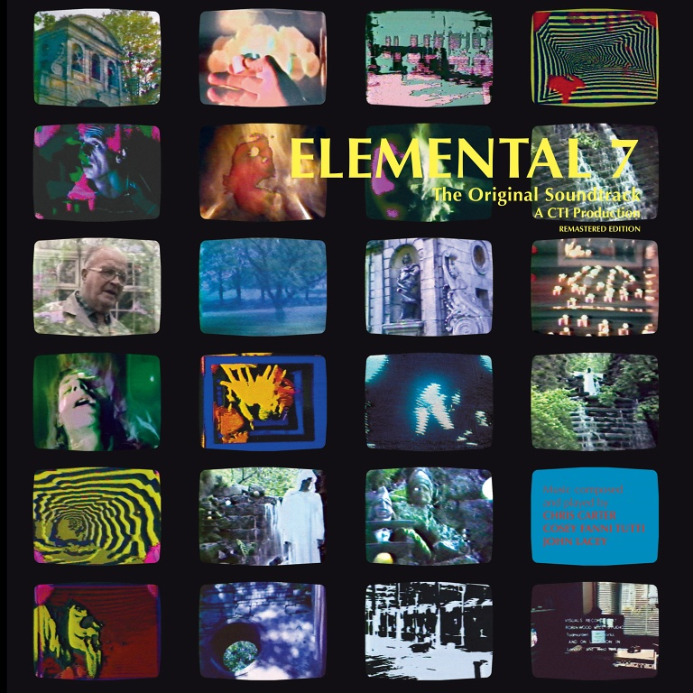
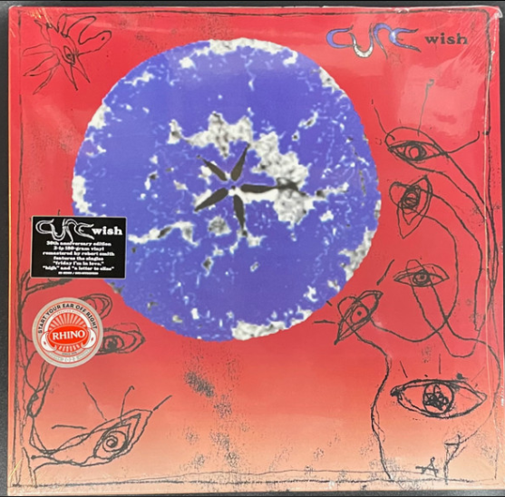

<!DOCTYPE html>
<html lang="en">
  <head>
    <meta charset="UTF-8" />
    <meta http-equiv="X-UA-Compatible" content="IE=edge" />
    <meta name="viewport" content="width=device-width, initial-scale=1.0" />
    
    <link rel="stylesheet" href="https://cdnjs.cloudflare.com/ajax/libs/font-awesome/6.3.0/css/all.min.css">
   
  </head>
  <body>

    

      

        <nav>
          <a href="#">top</a>
          <a href="#wrapper" id="Music">music</a>
          <a href="#interact" id="interact">interact</a>
          <a href="#share" id="Share">share</a>
          <a href="#about" id="about">about</a>

          <button id="themeBtn"></button>
          <!-- make nav links -->
        </nav>
      

    <section id="hero" class="content">

      
A space to explore new music

      
 Scroll to know more

    </section>

    

      

        <!-- 
        
        
        
        
         -->
      

      <h2>Top Rated Albums</h2>
       

      <ul id="favourite-list"></ul>
     <li></li>
    

  </section>

  <section id="two" class="content">
     
  

 
  </section>

</body>

    
    
    
   
  </body>
</html>
